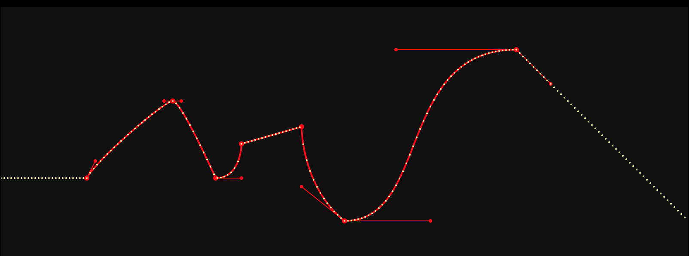

IPO
===

*IPO*, short for *InterPOlation*, is an easing library allowing to describe complex easings in JSON (multiple point over time can be placed).

> Inspired from Blender's IPO idea, it is made for animating a value in many ways over time.

Screenshot running [example.js](./example.js):



```json
[
  { "p": [100, 100], "upper": [10, 20] },
  { "p": [200, 190], "lower": [-10, 0], "upper": [10, 0] },
  { "p": [250, 100], "upper": [30, 0] },
  { "p": [280, 140] },
  { "p": [350, 160] },
  { "p": [400, 50], "lower": [-50, 40], "upper": [100, 0] },
  { "p": [600, 250], "lower": [-140, 0], "upper": [ 40, -40 ] }
]
```

*(the white dots are the interpolated values, the red point are the control points and their handles, the yellow curve is the SVG continuous curve.)*

API
===

```js
var IPO = require("ipo");
var ipo = IPO([ ...points... ]);
ipo(42); // Get the curve Y value at X=42
```

### Format

`points` is:

- an Array of Point, where each Point is an object with
  - a position `p` which is a `[x, y]`
  - (option) `lower`: relative position of a bezier handle for the lower curve interpolation
  - (option) `upper`: same for the upper curve interpolation.


Under the hood
==============

- [`bezier-easing`](https://github.com/gre/bezier-easing) is used to perform bezier interpolation. It provides efficient computation with various optimization techniques.
